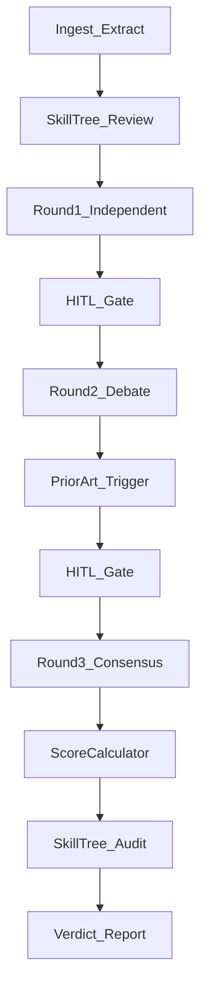

# Research Consensus Council — Agent Development Kit (ADK)

| Field | Value |
|---|---|
| **System** | Research Consensus Council (RCC) |
| **ADK version** | 1.0.0 |
| **Status** | As-built (matches runtime code) |
| **Related docs** | [ARCHITECTURE.md](ARCHITECTURE.md), [AGENTS.md](AGENTS.md), [PRD.md](PRD.md), [README.md](README.md), [SETUP.md](SETUP.md) |

## 1. Purpose and scope

This ADK is the **agent-kit contract** for RCC: how specialized review agents are defined, prompted, orchestrated across rounds, given tools, and how their outputs are validated, scored, persisted, and exposed to humans.

**In scope:** agent catalog, tool/skill I/O, deliberation state machine, data contracts, HITL gates, observability, guardrails, extension points.

**Out of scope:** pixel-level frontend visual design; Google Agent Development Kit (`google-adk`) runtime migration. This document is RCC’s product ADK, not the Google framework of the same acronym. Portal/HITL surface contracts are in scope (see §3.1).

## 2. Glossary

| Term | Meaning |
|---|---|
| **Council** | The five specialist agents plus the deliberation engine |
| **Criterion** | Single scoring dimension owned by one agent (single-authority model) |
| **Round** | One parallel pass where every agent emits an `AgentReview` |
| **HITL** | Human-in-the-loop pause between rounds (CLI or API) |
| **Stub mode** | No real LLM; scores are non-analytical / simulated (`simulation_mode: true`) |

## 3. Runtime topology

```
CLI (council.py) ──► extract → 3-round engine → SQLite → report JSON
                         │
API (api.py / Uvicorn) ──┼──► same engine in thread pool + HITL events
                         └──► WebSocket broadcast + frame replay
```

| Surface | Entry | Notes |
|---|---|---|
| CLI | `python council.py <paper>` | Optional stdin HITL; `--non-interactive` / `RCC_NON_INTERACTIVE=true` skips prompts |
| API | `python council.py --api` | FastAPI default `:8080`; local UI pairing often uses `:8090` (see [SETUP.md](SETUP.md)); deliberation via `POST /api/deliberate` |
| Portal | `frontend/` Vite React SPA | Landing → workspace; SideNav owns views; HITL via approve/abort APIs |
| Config | `config.settings` / env / optional `council_config.json` | Providers: `stub` (default), `ollama`, `openai` |

**Deployment constraint:** single Uvicorn worker (`--workers 1`) so in-memory circuit breaker and HITL state stay coherent. See [ARCHITECTURE.md](ARCHITECTURE.md).

### 3.1 Portal surface (operator UI)

| Element | Role |
|---|---|
| Landing (`LandingView`) | Marketing entry; **Access Portal** / **Start Validation** / Documentation enter the portal |
| TopNav | Chrome only: brand, notifications, Settings (no duplicate view tabs) |
| SideNav | Sole workspace navigator: Research, Council, Archive, Audit, Lab, Docs; Leave portal |
| History | `history.pushState({ rccPortal })` on enter; browser Back / Leave portal restore landing |

In-portal ADK copy is served from `frontend/public/ADK.md` (Docs view).

## 4. Agent catalog

Personas and responsibilities are detailed in [AGENTS.md](AGENTS.md). Canonical runtime definitions live in `AGENTS` inside `council.py`.

| Agent | Persona model | Criterion | Weight |
|---|---|---|---|
| Skeptical Reviewer | Orca-2 | Clarity & Presentation | 0.20 |
| Method Evaluator | Phi-4 | Methodology Rigor | 0.25 |
| Domain Expert | Mistral-7B | Novelty & Significance | 0.20 |
| Ethics Officer | Llama-3.2 | Ethics & Integrity | 0.20 |
| Industry Translator | Phi-3 | Practical Impact | 0.15 |

**Authority model:** each agent owns exactly one criterion. Final consensus uses Round 3 scores only, combined by `ScoreCalculator` with the weights above (must sum to 1.0 when tuned via API).

Provider model maps (`ollama_model_map` / `openai_model_map`) translate persona labels to concrete model IDs.

## 5. Tool and skill contracts

### 5.1 `extract_content(file_path) → PaperContent`

- **Inputs:** PDF or text path.
- **Outputs:** `abstract`, `methods`, `results`, `claims`, `full_text`, `content_hash`.
- **Behavior:** pdfplumber/pypdf extraction; section split; table normalization; citation regex. Unchanged hash reuses cached DB sections.

### 5.2 `ScoreCalculator.compute(weights, scores) → float`

- **Inputs:** criterion→weight map; criterion→score map (typically Round 3).
- **Output:** weighted sum rounded to 2 decimal places.

### 5.3 `PriorArtValidator.query_prior_art(query_text, n_results=3)`

- **Location:** `skills/prior_art_validator.py` (ChromaDB `PersistentClient`).
- **Trigger (engine):** after Round 2, if interim aggregate `< 3.5` **or** any Round 2 justification contains `"prior_art"` (case-insensitive).
- **Query text:** `claims` else `abstract` else first 500 chars of `full_text`.
- **Return:** `{ status, query, findings[{ content, source, confidence_score }], retrieval? }` or error shape with empty findings.
- **Backends:** `settings.retrieval_backend` = `chroma` | `jina` | `hybrid` (default). Hybrid uses Jina embeddings + rerank when `JINA_API_KEY` is set; otherwise Chroma text query only.
- **LLM tool schema:** see [AGENTS.md](AGENTS.md). Engine invokes the validator directly (not model tool-calling).

### 5.4 Skill tree (`skills.run_skill_tree`)

Hierarchical audit/review skills. Envelope: `{ status, skill_id, findings, evidence, score_hint?, message }`.

| Mode | Skills | Entry |
|---|---|---|
| `review` | claim_grounding, citation_hygiene, section_coherence | Pre-council; `python council.py --review`; `POST /api/skills/review` |
| `audit` | bias_drift, score_consistency, prior_art | Post-council; `--audit`; `GET /api/skills/audit` |

**Agent consumption:** After the review tree runs, `_format_skill_context` injects a `# SKILL CONTEXT (Jenni-style claim grounding)` block into every round’s `build_prompt` so agents can cite ungrounded/supported claims. HITL gates after R1/R2 are unchanged.

**Agent-kit registry:** [`skills/agent_tools.py`](skills/agent_tools.py) — `TOOL_SCHEMAS` + `dispatch_tool` for `query_claim_grounding` and `query_prior_art`. List via `GET /api/skills/tools`. Claim API: `POST /api/skills/claim_grounding?path=`. Schemas are registered for agents; there is **no multi-turn LLM tool-calling loop yet**.

**Jenni.ai:** no public API — claim_grounding mirrors Jenni-style claim confidence (evidence spans from **methods/results only** / ungrounded flags). Optional manual export of report JSON into Jenni Library.

**Jina AI:** `skills/retrieval/jina_client.py` — embeddings, rerank (`jina-reranker-v3.5`), reader (`r.jina.ai`). Soft-skips without `JINA_API_KEY`.

### 5.5 `run_monthly_audit() → dict`

- Batch drift stats (mean/min/max/count) per agent/criterion over Round 3 reviews.
- Also wrapped by `audit.bias_drift` inside the skill tree.

### 5.6 LLM call chain

`call_llm_with_retry` → `call_llm` → circuit breaker check → `call_llm_primary` → on failure `call_llm_fallback` (`settings.fallback_provider`, typically stub).

OpenAI path enforces JSON schema `AgentResponseSchema` (`score`, `justification`, `evidence`, `challenge_target`).

## 6. Orchestration protocol



| Phase | Peer context | Agent output extras |
|---|---|---|
| Round 1 | None (independent) | score, justification, evidence |
| Round 2 | Round 1 reviews | + optional `challenge_target` (peer agent name) |
| Round 3 | Round 1 + Round 2 | Final score/justification/evidence |

**Context assembly:** there is no separate Context Manager class. `build_prompt()` injects chronological peer reviews into the prompt; justifications are sanitized (strip `` ``` `` / `#`) and truncated at 800 characters.

**Verdict bands** (`determine_verdict`, score rounded to 2 dp first):

| Aggregate | Verdict |
|---|---|
| ≥ 4.5 | Accept |
| ≥ 3.5 | Minor Revisions |
| ≥ 2.5 | Major Revisions |
| &lt; 2.5 | Reject |

**Appeals:** `submit_appeal` appends `[AUTHOR REBUTTAL]` into in-memory claims/full_text, re-runs deliberation without overwriting the canonical paper row, updates appeals table.

## 7. Data contracts

### 7.1 `PaperContent`

`file_path`, `content_hash`, `abstract`, `methods`, `results`, `claims`, `full_text`.

### 7.2 `AgentReview`

`agent_name`, `criterion`, `score` (float 1–5), `justification`, `evidence` (list), `round`, `challenge_target` (Round 2 only).

### 7.3 LLM JSON (prompt schema)

Rounds 1 & 3:

```json
{"score": 0.0, "justification": "", "evidence": [""]}
```

Round 2:

```json
{"score": 0.0, "justification": "", "evidence": [""], "challenge_target": null}
```

**Parse failure:** score defaults to `3.0` with a fallback justification. **Clamp:** `max(1.0, min(5.0, score))`. **LLM hard failure:** review with score `3.0` and error justification; round continues.

### 7.4 Deliberation report (`generate_report`)

- `executive_summary`: `verdict`, `aggregate_score`, `simulation_mode`, `key_strengths`, `major_concerns`
- `individual_reviews`: Round 3 agents only
- `consensus_dissent`: `agreements` / `disagreements`
- `actionable_feedback`: `prioritized_revisions`, `rebuttal_template`, `decision_path`
- `skill_findings` (optional): `{ review, audit }` skill-tree payloads

### 7.5 Persistence

SQLite tables `papers`, `reviews`, `deliberations`, `appeals`, plus async `websocket_frames` — see [ARCHITECTURE.md](ARCHITECTURE.md).

## 8. Human-in-the-loop

| Mode | Mechanism |
|---|---|
| CLI | After R1/R2, stdin approve or `abort` (skipped if non-interactive / non-TTY) |
| API | `hitl_hook` bridges thread → `asyncio.Event`; UI calls `POST /api/approve_round` or `POST /api/abort_round` |

`active_deliberation.status`: `idle` | `deliberating` | `waiting_for_approval` | `completed` | `aborted` | `failed`.

## 9. Observability and persistence

| Channel | What is recorded |
|---|---|
| SQLite reviews / deliberations / appeals | Structured scores, justifications, verdicts, reports |
| WebSocket (`/api/ws/{paper_id}`) | Live events with monotonic `seq_id`; frames logged for replay |
| `council_notifications.log` + webhook | Verdict notifications |
| Circuit breaker WS | `system_alert` with `alert_type: circuit_breaker` |

**WebSocket event `type` values:** `deliberation_started`, `approval_required`, `round_approved`, `deliberation_completed`, `deliberation_aborted`, `deliberation_failed`, `system_alert`.

Replay: `GET /api/deliberation/{paper_id}/replay?since_seq=`.

**Not persisted today:** full raw prompts, raw LLM payloads, or separate chain-of-thought beyond `justification`.

## 10. Security and guardrails

- Peer-review injection hygiene in `build_prompt` (sanitize + truncate).
- Section slices capped at 3000 chars in prompts.
- Score clamp and JSON parse fallbacks.
- Circuit breaker failover after threshold failures; recovery via Half-Open.
- Single-worker memory model for breaker/HITL consistency.

## 10.1 Error handling contracts

| Layer | Failure | Behavior |
|---|---|---|
| Extraction | Missing file | `FileNotFoundError` → CLI exit 1; API `404` before start |
| Extraction | Corrupt/unreadable PDF or empty text | `RuntimeError` / `ValueError` → deliberation `failed` + WS `deliberation_failed` |
| Per-agent LLM | Call or JSON parse failure | Agent score falls back to `3.0`; round continues |
| Primary provider | Outage / circuit Open | Fail over to `fallback_provider` (usually stub) |
| HITL bridge | No running ASGI loop | `RuntimeError` (worker must use API lifespan loop) |
| Appeal | Empty rebuttal / unknown paper | API `400` / `404`; CLI returns `{"error": ...}` |
| Appeal | Re-deliberation crash | Error dict / API `500`; original paper row unchanged |
| API unhandled | Any unexpected exception | JSON `{"error": "Internal server error"}` with HTTP 500 |
| Prior art skill | Chroma/query failure | Skill returns `{status: "error", findings: []}`; engine logs and continues |
| Prior art skill | Chroma unavailable at import/init | Lazy import; init error stored; queries return structured error (council continues) |
| WS / frame log | Persist or send failure | Logged; does not abort deliberation |

## 11. Extension points

| Change | Where |
|---|---|
| Add/rename agent or criterion | `AGENTS` + `CFG["weights"]` / `council_config.json`; keep weights sum = 1.0 |
| Live weight tune | `POST /api/settings` `{"weights": {...}}` |
| New skill | Module under `skills/`; wire trigger in `_run_council_on_paper` |
| New provider | `call_llm_primary` / maps in `CFG` + `config.Settings` |
| HITL UX | Frontend + approve/abort API; keep `hitl_hook` contract |

## 12. Source map

| ADK concept | Code |
|---|---|
| Agent catalog | `council.AGENTS` |
| Prompt blueprint | `council.BASE_PROMPT`, `build_prompt` |
| Round loop | `run_round`, `_run_council_on_paper` |
| Scoring / verdict | `ScoreCalculator`, `determine_verdict` |
| Report | `generate_report` |
| Appeals | `submit_appeal` |
| Audit | `run_monthly_audit`, `skills.run_skill_tree("audit")` |
| Prior art | `skills.prior_art_validator.PriorArtValidator` |
| Skill tree | `skills/__init__.py`, `skills/review/*`, `skills/audit/*` |
| Agent tools | `skills.agent_tools.TOOL_SCHEMAS`, `dispatch_tool` |
| Jina client | `skills.retrieval.jina_client.JinaClient` |
| Circuit breaker | `circuit.CircuitBreaker`, `council.primary_breaker` |
| DB layer | `db.py` |
| API / HITL / WS | `api.py` |
| Settings | `config.settings` |

## 13. Known gaps / backlog

Honest deltas vs earlier stub docs and aspirational design:

1. **No central Context Manager** — context is prompt-assembled peer history only.
2. **No full prompt/response archive or separate CoT log** — structured reviews + WS frames only.
3. **Bias control is batch audit**, not live interception of agent outputs.
4. **Prior-art OpenAI tool schema** is documented for agents; engine calls retrieval skills directly.
5. **Chroma collection must be populated** separately; empty index yields empty findings without failing the council.
6. **Jenni.ai** has no public API — claim grounding is local; agents receive findings via prompt injection each round.
7. **Project Council** (progress/POC/risk personas) — deferred.
8. **No multi-turn LLM tool-calling loop yet** — `TOOL_SCHEMAS` in `skills/agent_tools.py` are registered; dispatch is sync/API/engine-driven.
